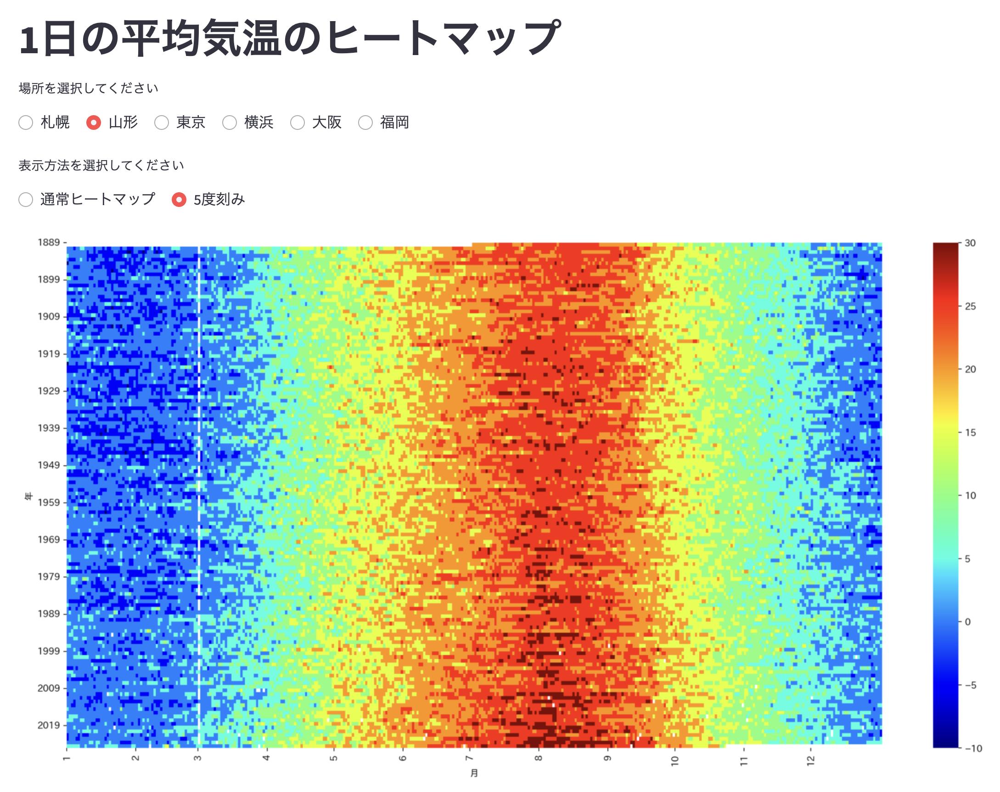

## これは何か？

- [東京の夏は着実に｢暑く･長く｣なっている](https://toyokeizai.net/sp/visual/tko/temperature/)

に触発され、私の実家のある山形のヒートマップを見たくなったので。


## do

```
python scraping.py

streamlit run streamlit_chart.py
```

## 気象庁データベース

- [気象庁：過去の気象データ検索](https://www.data.jma.go.jp/stats/etrn/index.php)
